# **PFR Instruction** — бот для предприятия «Северсталь».
Информация о пенсии на «Северстали» и всём, что с ней связано.

## Предназначение
Помощь сотрудникам отдела по пенсионным вопросам, обучение новых работников.

## Разделы бота
В общей сложности бот имеет три основных раздела с функциями, которые включают полезную информацию:
- Подготовка к пенсии
- Стаж работника предприятия
- Сайт "Госуслуги"

## Взаимодействие пользователя с ботом
Ниже представлена схема, визаулизирующая все запросы и подзапросы, выполняемые ботом:

```mermaid
flowchart TD;
    Main["Приветствие"];
    PensionPeriod["Готовлюсь к пенсии.\nС чего начать?"];
    GosuslugiRegistration["Госyслуги.\nКак зарегистрироваться?"];
    GosuslugiExperience["Как узнать свой стаж\nна сайте Госуслуг?"];
    ContactInfo["Куда обратиться по\nпенсионным вопросам?"];

    YearPeriod["До пенсии остался год.\nПроверка документов"];
    MonthPeriod["До пенсии остался месяц.\nПодача заявления"];
    NeedDocuments["Список\nдокументов"];

    MFCRegistrarion["Через МФЦ"];
    MobileBankAppRegistration["Через мобильное\nприложение банка"];

    ILSExplanation["Что такое\nИндивидуальный\nлицевой счёт?"];
    ILSAppealOrder["Порядок обращения за\nвыпиской ИЛС"];
    ILSDischargeGuide["Как понимать\nвыписку ИЛС?"];
    About2002Works["Что делать, если в ИЛС\nнет данных о работе\nдо 2002 года?"];

    Schedule["Часы работы\nФронт-офиса"];
    YearlyAttention["Важная\nинформация"];

    WhenApply["Когда и как подать\nзаявление через Госуслуги?"];
    PFRAppeal["Обращение в\nклиентскую\nслужбу ПФР"];
    MonthAttention["Полезная\nинформация"];



    Main --> PensionPeriod;
    Main --> GosuslugiRegistration;
    Main --> GosuslugiExperience;
    Main --> ContactInfo;

    PensionPeriod --> MonthPeriod;
    PensionPeriod --> YearPeriod;
    PensionPeriod --> NeedDocuments;

    GosuslugiRegistration --> MFCRegistrarion;
    GosuslugiRegistration --> MobileBankAppRegistration;

    GosuslugiExperience --> ILSExplanation;
    GosuslugiExperience --> ILSAppealOrder;
    GosuslugiExperience --> ILSDischargeGuide;
    GosuslugiExperience --> About2002Works;
    GosuslugiExperience --> ContactInfo;

    YearPeriod --> Schedule;
    YearPeriod --> NeedDocuments;
    YearPeriod --> YearlyAttention;

    MonthPeriod --> WhenApply;
    MonthPeriod --> PFRAppeal;
    MonthPeriod --> MonthAttention;
    
```

**! _*В данный момент (июнь 2022 года) мобильное приложение GitHub не поддерживает [mermaid](https://mermaid-js.github.io/mermaid). Для ознакомления со схемой вы можете перейти в [версию GitHub для ПК](https://github.com).*_**
## Как пользоваться ботом
Адрес бота в Telegram: [@pfrinstruction_bot](https://t.me/pfrinstruction_bot)

Весь процесс общения построен на принципе «вопрос-ответ». 
Напишите боту в личные сообщения и выберите на клавиатуре кнопку с 
интересующим Вас вопросом.

## Реализация проекта
- Библиотека для работы с Telegram - [aiogram](https://github.com/aiogram/aiogram)
- Иерархия построения сообщений бота - [textode](https://github.com/Masynchin/textode)
- Облачное хранилище для автономной работы проекта - [heroku](https://heroku.com)

## Лицензия
[MIT](https://github.com/bullbesh/pfr_instruction/blob/main/license.md)
